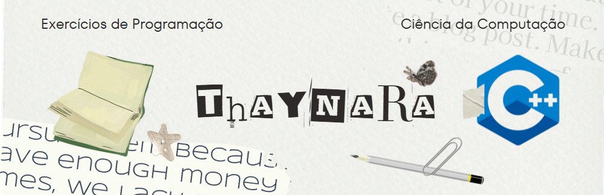

**\#** **Exercícios** **de** **C++** **para** **Fins** **de** **Estudo**

Este repositório contém uma coleção de exercícios práticos desenvolvidos durante meus estudos da linguagem C++. O objetivo principal é aplicar e solidificar conceitos fundamentais e avançados da programação orientada a objetos (POO) e da própria linguagem.

Cada pasta ou arquivo representa um projeto focado em um ou mais tópicos específicos, servindo como um registro do meu progresso e uma fonte de consulta para futuros projetos.

**\#** **Conceitos** **Abordados**

> **a.** **Fundamentos da Orientação a Objetos:**
>
    > **Construtores e Destrutores:** Gerenciamento do ciclo de vida dos objetos.
    >
    > **Encapsulamento:** Proteção e ocultação dos dados de um objeto.
    >
    > **Abstração:** Foco nos aspectos essenciais de um objeto, ignorando detalhes irrelevantes.
    >
    > **Polimorfismo:** Capacidade de um objeto ser referenciado de múltiplas formas, geralmente através de classes base e derivadas.
>
> **b.** **Recursos Avançados da Linguagem:**
>
    > **Relacionamento entre Classes:** Implementação de associação, agregação (independente) e composição (dependente).
    >
    > **Sobrecarga de Funções e Operadores:** Permitindo que funções e operadores trabalhem com diferentes tipos de dados e tenham comportamentos customizados.
    >
    > **Alocação Dinâmica de Memória:** Uso de `new` e `delete` para gerenciar memória manualmente.
    >
    > **Templates:** Criação de funções e classes genéricas que podem operar com qualquer tipo de dado.
>
>**c.** **Estruturas de Dados e Padrões de Projeto:**
>
    > **Lista Encadeada:** Implementação de uma estrutura de dados linear e dinâmica.
    >
    > **Padrão de Projeto Singleton:** Garantia de que uma classe tenha apenas uma instância e fornecimento de um ponto de acesso global a ela.
    >

**\#** **Estrutura** **do** **Repositório**

O repositório está organizado de forma que cada tópico ou exercício específico possa ser encontrado em sua própria pasta com implementações tanto no `.cpp` ou na própria header `.h`. Os nomes dos arquivos são autoexplicativos para facilitar a navegação e a identificação do conceito estudado.